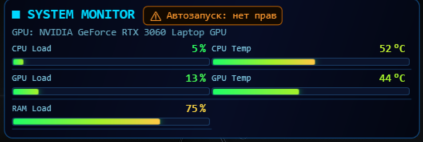

# Hardware Monitor Widget

Компактный cyberpunk WPF-виджет для мониторинга CPU/RAM/GPU в реальном времени.

## Стек

- WPF (.NET 8)
- LibreHardwareMonitor
- CommunityToolkit.Mvvm

## Возможности

- Отображение метрик: `CPU Load`, `CPU Temp`, `GPU Load`, `GPU Temp`, `RAM Load`
- Обновление данных: 1 раз в секунду
- Плавная анимация баров: 700 мс
- Компактный layout в 2 колонки
- Виджет без рамки окна, поверх остальных окон (`Topmost`)
- Перетаскивание виджета мышью
- Фиксированный размер без ресайза и без скролла
- Значения показываются целыми числами (без дробной части)
- Прогрессивный цвет бара по мере роста значения:
	- низкие значения — зелёный диапазон
	- средние — с переходом в жёлтый
	- высокие — с добавлением красного

## Скриншот



## Запуск

```bash
dotnet restore
dotnet build HardwareMonitorWidget.sln
dotnet run --project src/HardwareMonitorWidget/HardwareMonitorWidget.csproj
```

## Автозапуск

При старте приложение пытается зарегистрировать machine-wide задачу в Task Scheduler:

- имя задачи: `HardwareMonitorWidget`
- триггер: `ONLOGON`
- команда: запуск текущего `.exe`

В шапке виджета показывается короткий статус автозапуска, а подробности доступны в tooltip.
Если прав недостаточно, запустите приложение один раз от имени администратора.

## Если Windows Defender блокирует запуск (`0x800700E1`)

Рекомендуется использовать подписанный релизный `.exe` и избегать широких исключений Defender для папок/процессов.

Если исключение необходимо, добавляйте только конкретный итоговый бинарник приложения (а не `dotnet.exe` или IDE-процессы).
